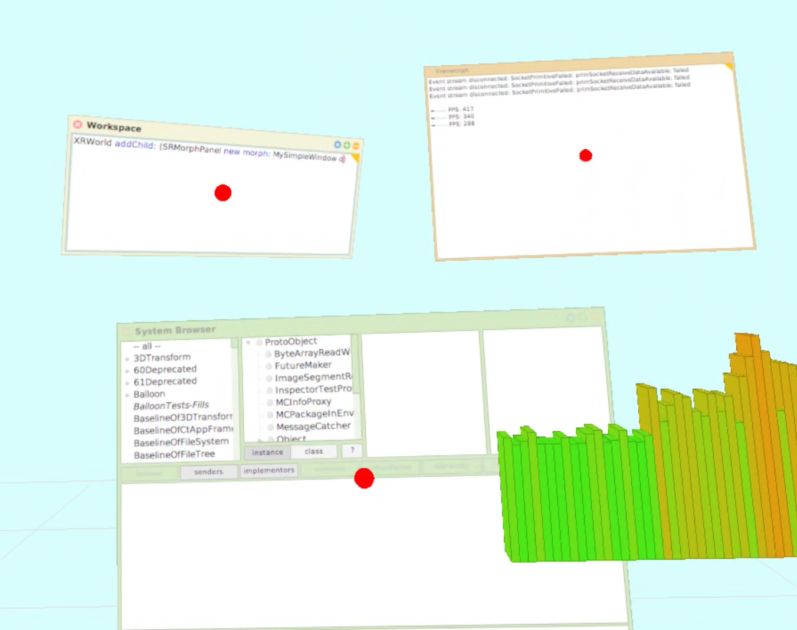

# SqueakXR

SqueakXR provides a XR interface for the [Squeak/Smalltalk](squeak.org) programming environment.

It currently only supports Meta Quest headsets.



## How to use

### Prerequisites

1. Set up a Meta Quest headset with developer mode. See [Meta Docs](https://developers.meta.com/horizon/documentation/native/android/mobile-device-setup/). Run `adb devices` to verify that it is available. If not, you may have to confirm a dialog within the headset.
2. Download [Android Studio](https://developer.android.com/studio)
3. Install [glslang](https://github.com/khronosGroup/glslang) and [SPIRV-cross](https://github.com/khronosgroup/spirv-cross).
4. Clone this repository.

### Prepare the Squeak image

*Alternatively, you can grab an image [from the releases](https://github.com/hpi-swa-lab/SqueakXRNative/releases).*

1. Use a trunk image or download it from https://files.squeak.org/trunk/. The last tested version is `Squeak6.1alpha-23704-64bit`.
2. Install dependencies by running:

```
Metacello new
    configuration: 'FFI';
    load.
Installer ss project: 'OSProcess'; install: 'OSProcess'.
Installer ss project: 'CommandShell'; install: 'CommandShell'.
Metacello new
    baseline: '3DTransform';
    repository: 'github://hpi-swa-lab/squeak-graphics-opengl:main/3DTransform/src/';
    load.
```
3. Using a Git client like [this](https://github.com/hpi-swa/git-s), open this repository and load it.
4. Run `SRShader transpileAll`.
5. Save the image.

### Compile and install the app

1. Open the android/ directory with Android Studio
2. Create a directory called `assets` in android/app/src/main. Copy the `SqueakV60.sources` file you downloaded with the Squeak image into it.
3. Connect your headset and select it.
4. Run the app.

### Launch SqueakXR

1. Launch the SqueakXR app on the headset.
2. If no image is available, load one in the 'Manage Images' menu. By default, you can serve images over http from a connected device on port 8080. Make sure that the endpoint is visible on the headset; you may have to reverse forward the port with `adb reverse tcp:8080 tcp:8080`. Also see 'Automatically fetching images' below.
3. Select the image in the main screen.
4. Click the 'Reset images' button. You only have to do this once after installing the app.
5. Hit launch.

#### Automatically fetching images

If the option 'Fetch image from remote on launch' is enabled, the launcher will automatically load and replace the currently selected squeak image from the endpoint specified under 'Manage images'.
By default, it will attempt to load the image from `http://localhost:8080`.
If you connect the headset to another machine (e.g. your development device), you can serve it from there by running `adb reverse tcp:8080 tcp:8080`.
Launching the app from Android Studio will automatically perform this for you.

## Usage Guide

*This section is work-in-progress.*

### Running the 3D world

The 3D interface ('World') can be started by creating an instance of `SRWorld` and calling `start` on it. 

```
world := SRWorld.
world start.
```

Worlds that are running will persist when saving the image.
They will automatically resume running when the image starts.

If you launch SqueakXR on a headset and no world is currently running in the image, a new SRWorld instance will be started automatically.

You get the current XRWorld with `Object>>currentXRWorld`.

### API Overview

The base class for 3D objects is `SRObject`.

Every 3D object in a world is organized as a [scene graph](https://en.wikipedia.org/wiki/Scene_graph), the root of which is the respective `SRWorld`.

#### Scene Hierarchy

A `SRObject` may have further `SRObject`s as children.

Call `addChild:` and `removeChild:` to add and remove children from an object respectively. You can add multiple children with `addChildren:`.

You can get a list of an objects children with `children` and a list of an object's descendants with `allDescendants`.

#### Transforms: Translation, Rotation, and Scale

Each `SRObject` has a local and a global transformation.
The latter is the local transformation of the object combined with the local transformation of each ancestor.
This means that each `SRObject` effectively inherits the transform of its parent.
If you e.g. translate an object, all of its descendants will be translated by the same amount.

Every object has a translation (position), rotation, and scale.
The local value for each object's transform can be accessed with the respective accessors (`translation`, `translation:`, `rotation`, `rotation:`, `scale`, `scale:`).
The entire transform can also be accessed at once with `transform` and `transform:`.
Global values can be accessed by prepending the accessors with `global`; using this, you can directly change the transform of an object in world space.

Related objects:
- `Vector3` for translation and scale; can be quickly instantiated with the `@` syntax, e.g. `1 @ 2 @ 3`
- `Quaternion` for rotation
- `Matrix4x4` for transforms

#### Stepping

If you want to execute behavior for a subclass of `SRObject` on every frame, you can override its `step:` method.

The method is passed the amount of time in seconds since the last frame.

Objects will stop stepping if an error occurs within their `step:` method.

#### Rendering

You can override the `renderOn:` method of a subclass of `SRObject` to display .
This method will be called every frame and is passed an instance of SRRenderer, which provides graphical primitives for you to call.

Objects will stop rendering if an error occurs within their `renderOn:` method.

It is often not necessary to override `renderOn:`.
Consider if you can achieve the same thing by adding children to your object (e.g. `SRCube` for displaying a cube).

#### Other

Simple graphical objects that you can use to quickly visualize something include:

- `SRCube`
- `SRSphere`

## Troubleshooting

### Launching the Squeak environment from the main screen fails with 'Fetching images failed!'

If you do not want to fetch an image on launch, disable the 'Fetch image from remote on launch' setting.

If you do want to fetch an image on launch, ensure that the endpoint is visible on the device.
You may have to reverse forward the port by running e.g. `adb reverse tcp:8080 tcp:8080` for port 8080.

### The app will not launch from Android Studio at all

`Process 'command '../run-setup.sh'' finished with non-zero exit value 1'`

Make sure that only one Android device is available (check with `adb devices`).
Shut down any emulated devices in Android Studio.
Also make sure that adb is in your PATH.

### After launching the XR environment, the app is stuck in the loading screen

Take a look at the logcat output.

If it cannot find `SqueakV60.sources`, you need to click the 'Reset images' button once in the launch screen.

If it does not say 'Starting new XR world', make sure that there is no SRWorld running in the image you are trying to launch (`SRWorld allInstancesDo: #stop`).

### My subclass of SRObject is not properly initialized / errors when calling methods like addChild:

Make sure that the `initialize` method of your object calls `super initialize`; the earlier the better.

## Working with dependencies locally

You can work with local copies of some dependencies by setting the following variables to the respective paths in `android/dev.properties` (`var=path`):

```
rlOpenXRRepo
opensmalltalkvmRepo
raylibRepo
```
